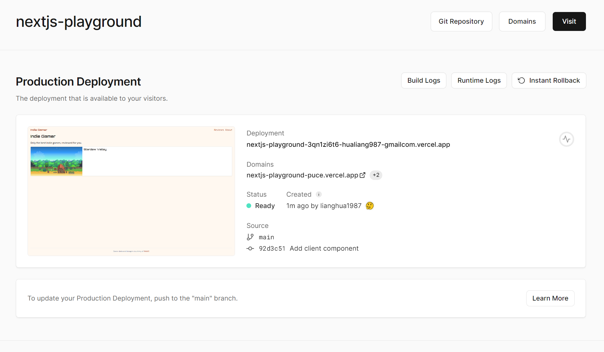

```shell
$ npx run dev
$ npx tailwindcss init --postcss
```

### Static site deployment
```shell
$ npm run build
$ npx serve@latest out
```

### Deployment
- Vercel - https://nextjs-playground-puce.vercel.app/
  